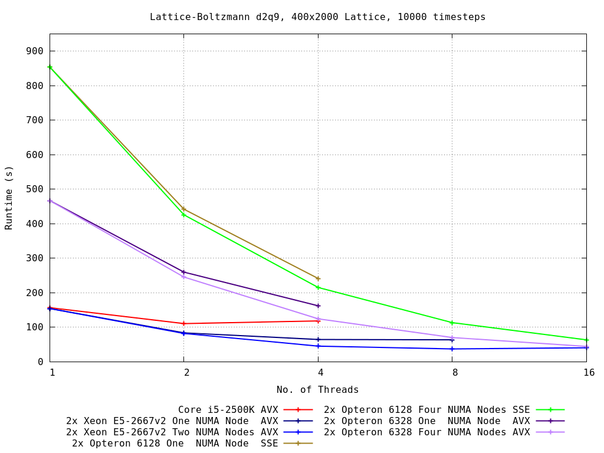
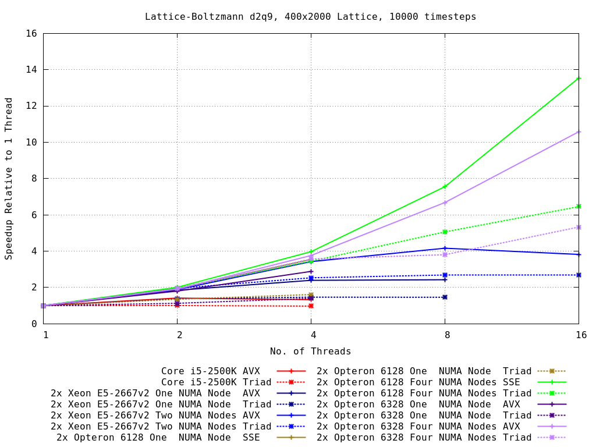
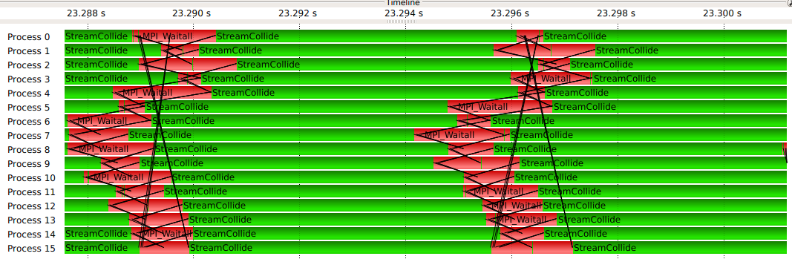
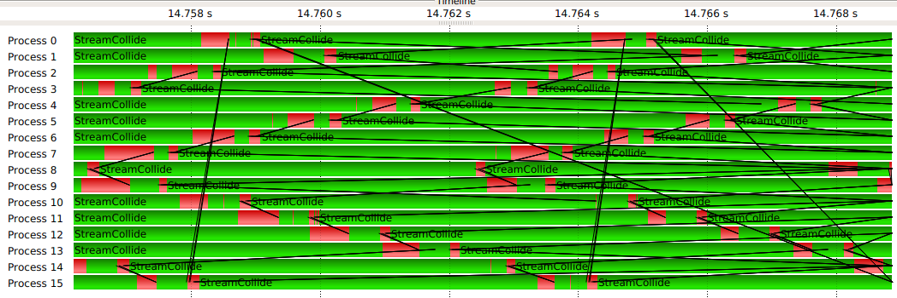
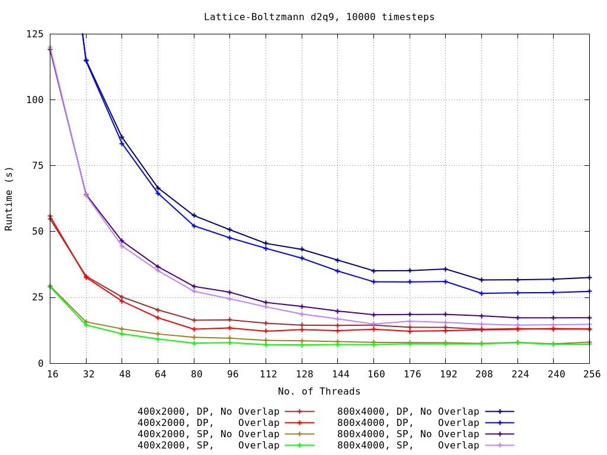
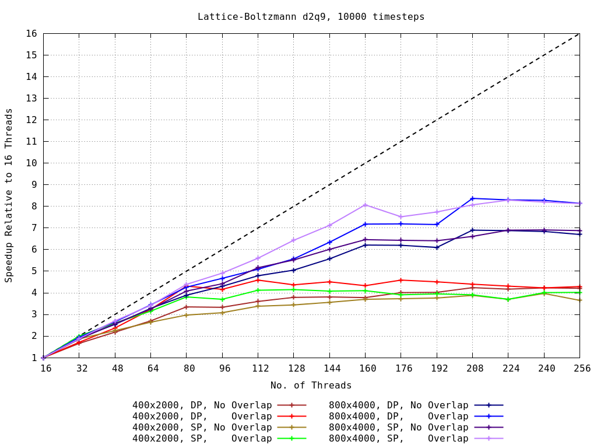

# latticeboltzmann

Implementation of D2Q9 Lattice Boltzmann, with Bhatnagar-Gross-Krook collision approximation.


Space is discretized on a 2d lattice, and particle distribution functions ("velocities") are discretized onto the links between lattice points and give the probability that a particle will move from one lattice point to the next, denoted:

```
   f6  f2  f5
     \  |  /
x   f3--f0--f1
^    /  |  \
|   f7  f4  f8
|
 --- > y
```

Lattice-site local macroscopic variables `rho = Sum f_i` and velocity `u = 1/rho Sum f_i e_i`, where `e_i` are vectors pointing along the lattice links.

Each timestep, the particle distribution functions are updated as

`f_i(x+e_i*dt, t+dt) = f_i(x,t) - 1/tau [f_i(x,t) - feq_i(x,t)]`

where (in the BGK approximation)

`feq_i = omega_i rho(x) [1 + 3/2 e_i.u_i(x)/c^2 + 9/2 (e_i.u_i(x))^2/c^4 - 3/2 u(x)^2/c^2]`.

`tau` is the relaxation parameter and `omega_i` At walls we implement "bounce back" (no slip) conditions, and the domain wraps around at the edges.


### CPU Implementation
Implemented with AVX/SSE vector intrinsics and OpenMP. We vectorize over the "long" y direction, and parallelize over the shorter x direction. The algorithm is very memory-bandwidth constrained, since the computation scales linearly with the lattice size.

As the plot below shows, for some CPUs we receive no benefit whatsoever by parallelizing across multiple cores with OpenMP. Hyperthreading provided no benefit on Intel CPUs.



Plotting the speedup relative to a single thread alongside the bandwidth improvement factor by adding threads to the STREAM Triad benchmark, we see that parallel speedup here is only possible if adding threads provides access to additional memory bandwidth. We see also the sensitivity to scheduling threads appropriately on NUMA machines.




#### MPI
By running the computation across multiple nodes with MPI, we can take advantage of the additional memory bandwidth that comes with each extra node. Since data is read from neighbouring rows, we have to exchange the data at node boundaries of the lattice before the Stream step. Rows that don't neighbour a boundary have no such dependency, so we can hide the communication behind the computation of the inner rows.





Overlapping means that running one rank on each of 16 nodes, communication time drops from ~17% to ~8% (400x2000 lattice).

We obtain reasonable scaling with node count, particularly for larger domains where each node has enough work to do to hide the communication. The speedup flattens out when we saturate the gigabit ethernet interconnects at around ~165MB/s.






### GPGPU
GPUs provide a huge amount of memory bandwidth compared to what CPUs typically have available. By writing OpenCL kernels for the computation, we can easily run the code on many devices. In the following tables the i5-2500K is running with 2 threads (the fastest configuration).

Lattice: 400x2000, 10,000 timesteps.
| Device           | Runtime (s) DP | Speedup | Runtime (s) SP | Speedup |
|:-----------------|:---------------|:--------|:---------------|:--------|
| i5-2500K AVX     | 110.31         | 1.00    | 55.89          | 1.00    |
| i5-2500K Intel OpenCL | 152.10    | 0.72    | 59.53          | 0.94    |
| i5-2500K pocl    | 179.23         | 0.62    | 107.37         | 0.52    |
|                  |                |         |                |         |
| NVIDIA GTX 960   | 18.17          | 6.07    | 8.21           | 6.81    |
| AMD HD7730M      | 51.06          | 2.16    | 44.40          | 1.26    |
| AMD R9 280X      | 7.34           | 15.03   | 4.21           | 13.28   |

Lattice: 400x4000, 10,000 timesteps.
| Device           | Runtime (s) DP | Speedup | Runtime (s) SP | Speedup |
|:-----------------|:---------------|:--------|:---------------|:--------|
| i5-2500K AVX     | 224.99         | 1.00    | 113.80         | 1.00    |
|                  |                |         |                |         |
| NVIDIA GTX 960   | 37.05          | 6.07    | 15.27          | 7.45    |
| AMD R9 280X      | 13.76          | 16.35   | 7.49           | 15.19   |